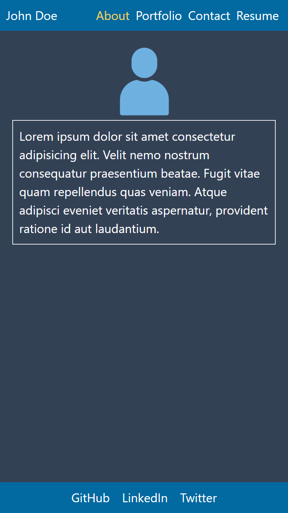

# React-Portfolio

## Table of Contents

1. [Description](#Description)
1. [Installation](#Installation)
1. [Deployed Instance](#Deployed-Instance)
1. [Questions](#Questions)

## Description

This is a mock portfolio for a developer using react.

## Installation

Clone the repository and run `npm install` inside of its directory.
Run `npm start` to start the react application.

## Deployed Instance

This [link](https://rrrbbbsss.github.io/React-Portfolio/) will take you to a deployed application.

## Questions

Github Account: [rrrbbbsss](https://github.com/rrrbbbsss)
